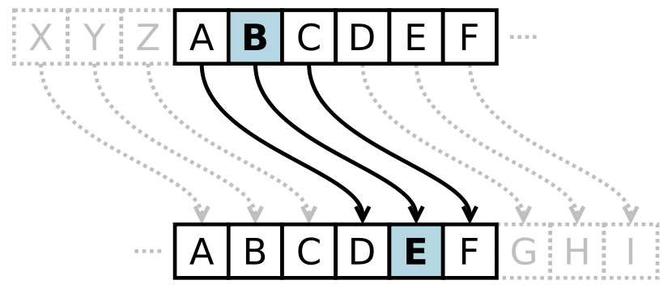

# Caesar Cipher

### Check out this working example: [Caesar Cipher Demo](https://jpbruehw.github.io/caesar-cipher/)

A Caesar cipher is a simple method of encoding messages. Caesar ciphers use a substitution method where letters in the alphabet are shifted by some fixed number of spaces to yield an encoding alphabet. A Caesar cipher with a shift of 1 would encode an A as a B, an M as an N, and a Z as an A, and so on. The method is named after Roman leader Julius Caesar, who used it in his private correspondence. Here is what Caesar Cipher with a shift of three would look like:


## Usage

To use the Caesar Cipher program, follow these steps:

1. Clone the repository to your local machine:
   ```
   git clone https://github.com/jpbruehw/caesar-cipher.git
   ```
2. Navigate to the project directory:
   ```
   cd caesar-cipher
   ```
3. Install dependencies:
   ```
   npm install
   ```
4. Run the program:
   ```
   npm run dev
   ```

Feel free to customize it further based on your project's specific features and requirements!
